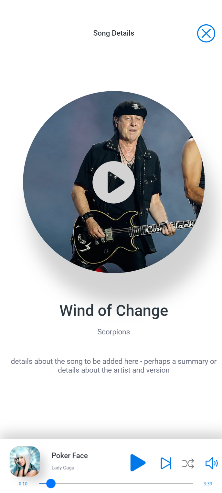

# PartyPlaylistApp

## Overview

Create your own playlist with all your favourite tunes in one place!

## Instructions

1. `npm install` - Install dependencies

2. `npm run build` - Build dev

3. `npm run styles` - Build Styles

## Demo

  Watch a demo of the app on YouTube: https://youtu.be/D5361oYLE0c
  
     

## Further features to be implemented

